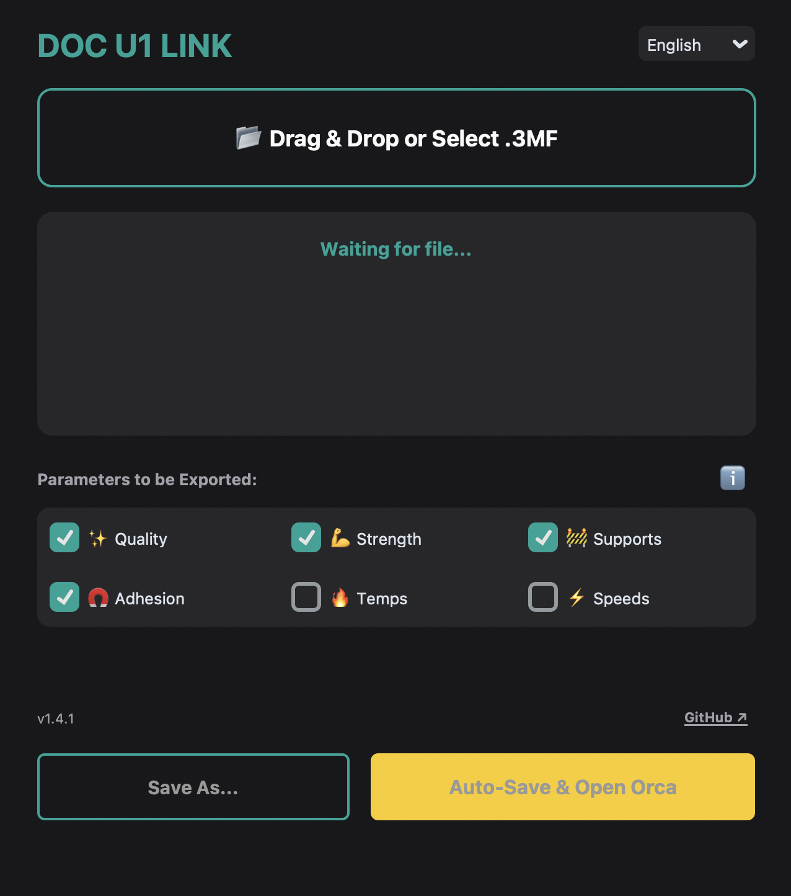
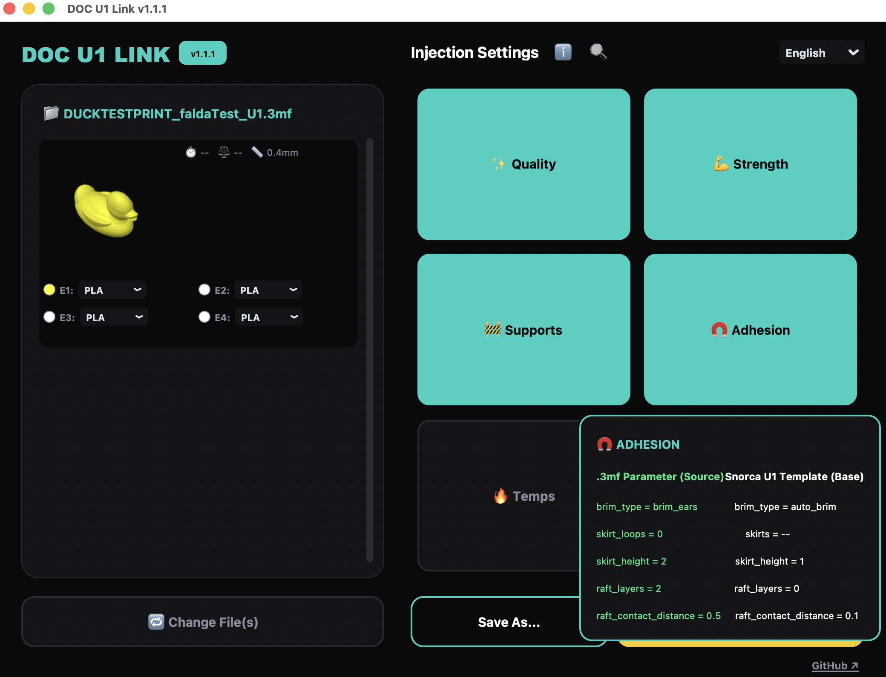
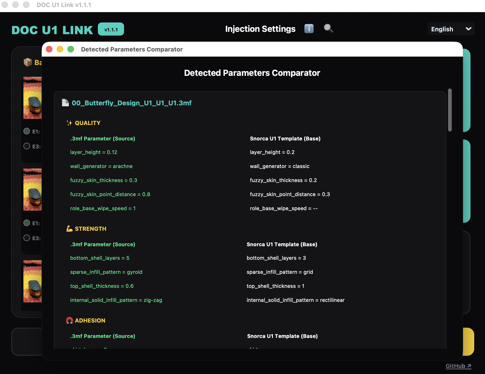

# DOC U1 Link 🔗
---


<p align="center">
  <a href="https://github.com/Dakros66/DOC-U1-Link/releases/latest">
    
  </a>
</p>

---
# 📸 Screenshots
<p align="center">
  
</p>

<p align="center">
  <a href="screenshots/ex1.png">
    
  </a>

  <a href="screenshots/ex2.png">
    
  </a>

  <a href="screenshots/ex3.png">
    
  </a>
</p>

---

## 🚀 What is DOC U1 Link?

**DOC U1 Link** is a professional workflow utility designed exclusively for **Snapmaker U1** users.

The application acts as an intelligent bridge between:

- **Bambu Studio**
- **MakerWorld**
- **Snapmaker Orca**

It converts **Bambu Studio `.3mf` projects** into files that are fully compatible and optimized for the **Snapmaker U1 ecosystem**.

Instead of manually rebuilding profiles, materials, supports, and machine settings, **DOC U1 Link** automatically restructures the project while preserving the creator’s original intent whenever possible.

---

## 🛡️ Why This Tool Exists

When you download a `.3mf` project from platforms like MakerWorld, you aren't just downloading a 3D model—you are downloading hours of the creator's hard work. They have carefully tuned the supports, optimized the infill, and dialed in the layer heights to ensure the model prints perfectly.

However, directly opening a Bambu Studio file in Snapmaker Orca often leads to machine conflicts. Because the proprietary hardware parameters, bed dimensions, and custom start/end G-codes don't match, the slicer is usually forced to discard the creator's custom profile, leaving you to guess the correct settings from scratch.

**DOC U1 Link** was built to bridge this gap. 

Instead of losing the creator's original print characteristics, our engine safely extracts their specific tuning (the "secret sauce") and seamlessly translates and injects it into a clean, fully validated **Snapmaker U1** template. 

The result? You preserve the exact structural and aesthetic intentions of the original design, effortlessly and natively tailored for your machine.

**DOC U1 Link** safely sanitizes those files and rebuilds them around validated **Snapmaker U1** templates.

---

# 🌟 Key Features

---

## 📦 Batch Processing Engine

Convert entire collections of `.3mf` files simultaneously.

### Features
- Multi-file drag & drop
- Queue-based processing
- Independent configuration per project
- Automated conversion pipeline
- Safe staggered Snapmaker Orca launching

This allows you to process large MakerWorld collections in one operation.

---

## 📏 Smart Nozzle Detection & Dynamic Profile Injection

The application automatically detects the nozzle diameter used by the original creator.

### Supported nozzle sizes
- `0.2 mm`
- `0.4 mm`
- `0.6 mm`
- `0.8 mm`

DOC U1 Link dynamically injects:
- Matching printer profiles
- Correct process profiles
- Compatible extrusion settings

Everything is rebuilt automatically around validated **Snapmaker U1** configurations.

---

## 🎨 Interactive Filament Management System

The UI extracts all filaments directly from the source project.

### Supported actions
- Interactive filament remapping
- Material reassignment
- Per-object color editing
- Native color picker support

### Supported materials
- PLA
- PETG
- ABS
- TPU

The app also preserves AMS-style extrusion assignments whenever possible.

---

## 🔍 Delta Mode Inspector

Never guess what settings are being modified.

### Smart Tooltip Engine
Hovering over any settings category displays contextual parameter information instantly.

### Inspector Modal (🔍)
Compare the exact parameter differences between:
- Original Bambu Studio project
- Snorca template
- Final exported project

Displayed in a clean side-by-side comparison interface.

This makes the conversion process fully transparent and debuggable.

---

## 🧠 Smart Data Surgery System

The conversion engine automatically removes:
- Unsafe machine parameters
- Vendor-specific settings
- Unsupported hardware definitions

### Automatically sanitized parameters
- Kinematic limits
- Start G-code
- End G-code
- Bed dimensions
- Motion settings
- Machine identifiers
- Firmware-specific instructions

This prevents:
- Printer collisions
- Invalid movement ranges
- Profile corruption
- Unsafe slicing behavior

---

## 🎛️ Selective Preservation (Whitelist System)

The application uses a strict **Whitelist Architecture**.

You decide exactly which categories should be preserved from the original project.

---

### ✨ Quality Settings
Preserve:
- Layer heights
- Line widths
- Surface patterns
- Seam positioning
- Fuzzy Skin
- Ironing settings

---

### 💪 Strength Settings
Preserve:
- Infill density
- Infill patterns
- Wall loops
- Structural shell thickness
- Top/bottom layer configurations

---

### 🚧 Support Settings
Preserve:
- Tree supports
- Standard supports
- Support thresholds
- Branch distances
- Support interface behavior

---

### ⚡ Adhesion, Speed & Temperature Settings

Choose between:
- Importing the creator’s original tuning
- Using your own validated local U1 defaults

Supported imports:
- Speeds
- Accelerations
- Brims
- Temperatures
- Adhesion behavior

---
# Compiled Versions for Windows and Mac (Linux version must be compiled by you)
<p align="center">
  <a href="https://github.com/Dakros66/DOC-U1-Link/releases/latest">
    
  </a>
</p>


# 🚀 Installation

## 📋 Requirements

### Operating Systems
- Windows
- macOS
- Linux

### Runtime
- Python **3.9+**

---

## 1️⃣ Clone the Repository

```bash
git clone https://github.com/Dakros66/DOC-U1-Link.git
cd DOC-U1-Link
```

---

## 2️⃣ Install Dependencies

```bash
pip install customtkinter tkinterdnd2 Pillow
```

---

## 3️⃣ Run the Application

```bash
python DOC-U1-Link.py
```

---

# 📂 Required Base Files

For proper conversion, the following files must exist in the same directory as the application:

| File | Description |
|---|---|
| `u1_template.3mf` | Structural base template for standard prints |
| `u1_template_supports.3mf` | Structural base template for supported prints |
| `filament_types.3mf` | Filament mapping dictionary for Orca compatibility |

---

# 🛠️ How to Use

---

## 1️⃣ Load File(s)

Drag & drop:
- One `.3mf` file
- Multiple `.3mf` files

directly into the application window.

You can also use the manual browse button.

---

## 2️⃣ Configure & Edit

### Parameter Controls
Enable or disable the categories you want to preserve.

### Filament Editor
Modify:
- Material types
- Filament mappings
- Extrusion colors

### Inspector System
Use the **Inspector (🔍)** to preview exactly what will be injected or replaced.

---

## 3️⃣ Convert

For single projects:
```text
🚀 Save & Open Orca
```

For batch processing:
```text
🚀 Auto-Convert Batch
```

---

## 4️⃣ Print

Snapmaker Orca launches automatically with your converted projects fully prepared for slicing and printing on the **Snapmaker U1**.

---

# ℹ️ Authorized Parameters

DOC U1 Link uses a strict **Whitelist System** to guarantee:
- Machine safety
- Profile integrity
- Cross-platform compatibility
- Predictable slicing behavior

The complete list of exported parameters can be inspected anytime through the in-app **ℹ️ Information Panel**.

---

# 🤝 Contributions

Contributions are welcome.

If you discover:
- Missing whitelist parameters
- Compatibility issues
- Bugs
- Workflow improvements
- UI enhancements

feel free to:

- Open an **Issue**
- Submit a **Pull Request**

---

# ⚖️ License

This project is licensed under the **GNU GPLv3**.

See the `LICENSE` file for more information.

---

# 👨‍💻 Author

Developed by **Dakros66**

---

# 🙏 Acknowledgements

Special thanks to the **bl2u1** project for early inspiration regarding `.3mf` conversion workflows and parsing approaches.
